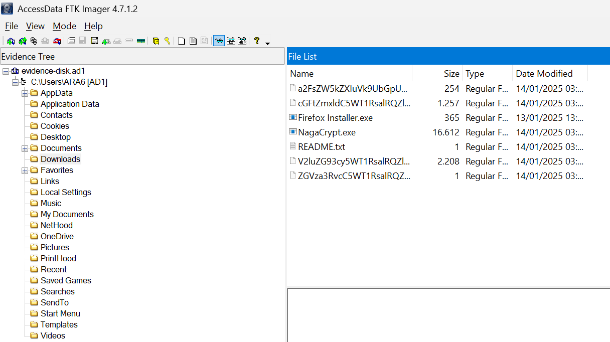
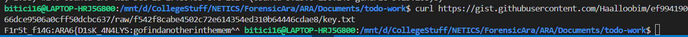
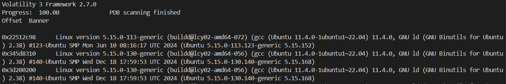
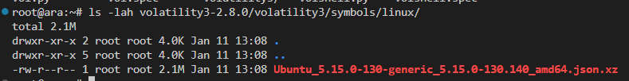
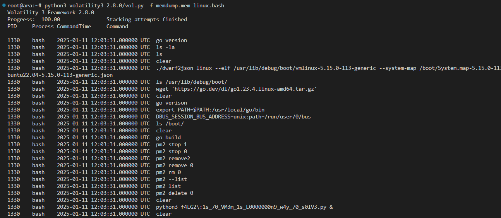

# Kena Sial Karena Sang Naga 

Author: Haalloobim

---------

## POC / Solver

- Diberikan sebuah `.zip` file yang berisi disk dari laptop yang akan di analisis menggunakan FTK Imager. 
- Terdapat sebuah malware yang digunakan threat actor untuk mengenkripsi file file yang ada di PC manager tersebut. 

    

- Ketika menganalisis malware tersebut, ternyata malware tersebut dibuild menggunakan `pyinstaller`
- Kemudian decompile malware tersebut menggunakan [pyinstxtractor](https://pyinstxtractor-web.netlify.app/) dan didapatkan pyc dari malware tersebut dan melakukan decompile pyc menggunakan [PYCdecompiler](https://pylingual.io/)
- Setelah melakukan beberapa proses decompile akhirnya mendapatkan kode python yang berfungsi untuk mengekripsi, tetapi telah di obfuscate kurang lebih seperti beirkut: [kode](./src/obfuscatedEnc.py)
- Setelah melakukan deobfuscate menjadi kurang lebih seperti kode berikut: [kode](./src/fileEnc.py)
- Dapat dilihat kode berikut mengenkripsi dengan menggunakan algoritma AES, dengan `key` di fetch dari sebuah url  dan `iv` berada pada masing masing file. Key tersebut merupakan flag part pertama.  

    

- Berikut kode file decryption yang telah dibuat:

    ```py
    import os
    import requests
    from Crypto.Cipher import AES
    from Crypto.Util.Padding import unpad
    import base64

    FetchedKey = 'ARA6{D1sK_4N4LYS'

    def dec_filename(file_path):
        print(f"BAASENAME ->  {file_path}")
        test = file_path.split('.')[0]
        print(f"TEST -> {test}")
        real_filename = base64.urlsafe_b64decode(test.encode('utf-8')).decode('utf-8')
        return real_filename.split('.')
        
    def decrypt_file(file_path):
        print(f"Decrypting {file_path}")
        name, iv, ext = dec_filename(os.path.basename(file_path))
        
        with open(file_path, 'rb') as file:
            data = file.read()
            iv = iv.encode('utf-8')
            key = FetchedKey.encode('utf-8')
            cipher = AES.new(key, AES.MODE_CBC, iv)
            decrypted_data = unpad(cipher.decrypt(data), AES.block_size)
        file.close()
        decrypted_file_path = os.path.join(os.path.dirname(file_path), name + '.' + ext)
        # print(f"Decrypted File Path: {decrypted_file_path}")
        with open(decrypted_file_path, 'wb') as decrypted_file:
            decrypted_file.write(decrypted_data)
        os.remove(file_path)


    def Decrypt(ext):
        for dirpath, dirnames, filenames in os.walk('.'):
            for file in filenames:
                if file.endswith((ext)):
                    decrypt_file(os.path.join(dirpath, file))
                    # print(f"Decrypting {os.path.join(dirpath, file)}")
                else:
                    continue


    if __name__ == '__main__':
        ext = ".naga"
        Decrypt(ext)
    ```
- Setelah melakukan dekripsi semua file, di dapatkan sebuah file `.mem` dan akan dilakukan analisis menggunakan volatility3
- Pada saat dilakukan pengecekkan profile menggunakan plugin `banners.Banners` didapatkan bahwa memory capture tersebut merupakan linux dengan versi antara 

    

    ```sh
    Linux version 5.15.0-113-generic (buildd@lcy02-amd64-072) (gcc (Ubuntu 11.4.0-1ubuntu1~22.04) 11.4.0, GNU ld (GNU Binutils for Ubuntu) 2.38) #123-Ubuntu SMP Mon Jun 10 08:16:17 UTC 2024 (Ubuntu 5.15.0-113.123-generic 5.15.152)
    Linux version 5.15.0-130-generic (buildd@lcy02-amd64-056) (gcc (Ubuntu 11.4.0-1ubuntu1~22.04) 11.4.0, GNU ld (GNU Binutils for Ubuntu) 2.38) #140-Ubuntu SMP Wed Dec 18 17:59:53 UTC 2024 (Ubuntu 5.15.0-130.140-generic 5.15.168)
    ```

- Karena untuk menganalisis memory linux menggunakan volatility3 diharuskan untuk membuat custom system profile symbol sendiri, kita dapat membuat dengan mengikuti langkah langkah di website berikut: [Custom Profile](https://medium.com/@alirezataghikhani1998/build-a-custom-linux-profile-for-volatility3-640afdaf161b) atau mencari pada website yang disarankan volatility3 -> [Custom Profile](https://isf-server.techanarchy.net/) atau dengan mendownload dari system profile symbol yang disediakan oleh komunitas di [sini](https://github.com/Abyss-W4tcher/volatility3-symbols/tree/master). 
- Setelah mendapatkan custom system profile symbol tersebut, kita menaruh file tersebut ke `[vol-download]/volatility3/symbol/linux/`

    

- Setelah itu kita sudah dapat menggunakan volatility seperti biasa. Kita akan menggunakan linux.bash untuk mendapatkan history bash dan flag part ke 2 bisa didapatkan.

    


Flag: `ARA6{D1sK_4N4LYS1s_70_VM3m_1s_L0000000n9_w4y_70_s0lV3}`