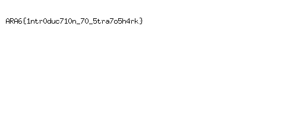

## POC What Shark?

### Steps:

1. Analyze the data using **Stratoshark**.
2. Apply the following filter to isolate traffic: `fd.name == “192.168.64.1:61777->192.168.64.17:8080”`
3. In packet `15781`, there is a `PATCH` request containing hex data for a PNG file in the body.
4. Extract the hex data and reassemble it to reconstruct the image.
5. Use the following script to automate the hex-to-PNG conversion:

```python
import binascii

def hex_to_png(hex_string, output_path='flag.png'):
    hex_string = hex_string.replace(' ', '').replace('\n', '')
    
    try:
        binary_data = binascii.unhexlify(hex_string)
        
        with open(output_path, 'wb') as f:
            f.write(binary_data)
        print(f"Image saved to {output_path}")
    except Exception as e:
        print(f"Error: {e}")

hex_data = """
89 50 4E 47 0D 0A 1A 0A 00 00 00 0D 49 48 44 52 ...
"""  # Truncated for readability

hex_to_png(hex_data)
```

6. Got the flag 
7. .