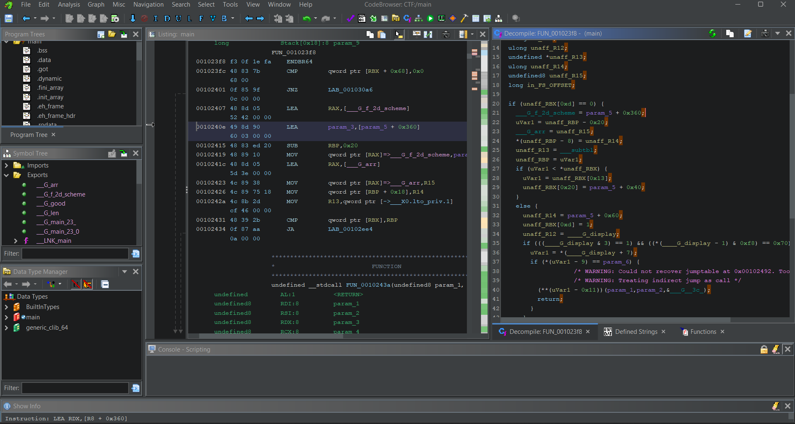
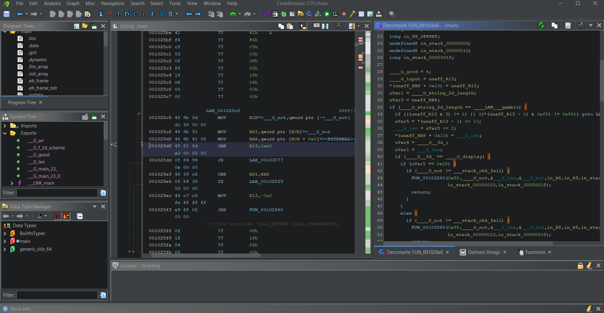

# Solver

1. Proses debugging logika pengecekan password dapat dimulai dari fungsi `___H_main`. Setelah instruksi `JMP RAX` di awal, program akan melakukan inisialisasi objek Scheme `f-scheme` dan `arr`.

Didapati value pada `arr` sebagai berikut (0x1a8, 0x1d4, 0x150, 0x1e4, ......)


2. Setelah program menerima input, pada instruksi `JMP RAX` di `___H_main`, program melakukan jump ke logika pengecekan panjang input. Program juga melakukan insialisasi nilai `good` dengan nilai awal 1 (0x4 >> 2).


Berikut adalah hasil debug dengan input berupa `ABC`

Didapati komparasi nilai 0xa0 dengan 0xc (0x3 << 2). Maka didapati bahwa panjang password seharusnya adalah 0x28 atau (0xa0 >> 2)

3. Setelah itu, melalui instruksi `JMP RAX` pada `___H_main`, program akan masuk ke pengecekan dengan looping sebanyak panjang inputan.


Didalam looping program mengambil nilai dari `arr` sesuai index looping menggunakan `list-ref`

dan dilanjutkan dengan pemanggilan `f-scheme` yang mana argumen yang digunakan dalam pemanggilan `f-scheme` adalah index looping dan akan melalui pemanggilan `___SCMOBJ_to_INT` terlebih dahulu.

Logika yang ada pada saat pemanggilan `f-scheme` sama persis dengan logika yang ada pada function `f`.

Lebih mudahnya, kita bisa langsung set breakpoint pada debugger dengan peritnah `b f`

Hasil return value dari `f` akan melalui pemanggilan `___INT_to_SCMOBJ` sebelum dilakukan operasi bitwise and dengan 0xff (0x3fc >> 2)

Hasil operasi bitwise and akan dilakukan operasi bitwise xor dengan value karakter yang kita inputkan diawal.


Hasil operasi bitwise xor akan dibandingkan dengan value yang ada pada `arr` jika tidak sama maka nilai `good` akan diset ke 0.

## Solver Script

```py
import gdb

def f(n):
    return n * n + 2 * n + 3

gdb.execute('file main')
base = "0x555555554000"
gdb.execute(f'b *{base}+0x2674')

pw_len = 0x28
input = "A" * pw_len + "\\n"
flag = ''
gdb.execute(f'run <<< "$(echo -e \'{input}\')"')

for i in range(pw_len):
    rdi = int(gdb.execute('p $rdi', to_string=True).split(" ")[-1], 16)
    flag += chr((rdi >> 2) ^ (f(i) & 0xff))
    gdb.execute('set $r13 = $rdi')
    gdb.execute('c')

print(flag)
```